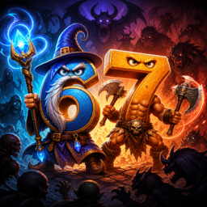

# 67-survivors

Кооп-рогалик на 2-4 игрока, top-down. Гибрид классовой RPG-боёвки (Magicka / Hammerwatch) и стакающихся апгрейдов (Vampire Survivors / Айзек). Полный геймдизайн-документ — [CLAUDE.md](CLAUDE.md).

## Запуск

```
make editor    # Godot editor
make run       # лобби
make smoke     # headless test
make peer      # 2 окна для локального мультиплеера
make import    # переимпорт ассетов
make clean     # сбросить .godot кеш
```

Godot 4.6+. Сетевой стек — встроенный ENet + MultiplayerSpawner/MultiplayerSynchronizer.

## Архитектура

Чистая архитектура в Godot — это не порты-адаптеры из Java. Это **идиоматичная композиция**: ноды для поведения, ресурсы для данных, сигналы для событий, чёткая граница host vs view. Ниже — принципы, на которых стоит проект, и почему именно так.

### 1. Server-authoritative с одной точкой решения

Хост (или соло-инстанс) — единственная истина. Клиент только рисует то, что прилетело по репликации.

Каждый sim-метод гейтится **одной** проверкой `GameState.is_authority()` ([src/core/game_state.gd](src/core/game_state.gd)). Никаких разнобойных `multiplayer.is_server() and ...` по коду — одна функция, одна семантика, работает в соло (нет peer'а → авторитет).

Реплицируется **минимум**: только то, что нужно вьюхе. Хост-внутренние стейты (StatBlock, AI-таймеры, кулдауны скиллов) живут в обычных `var` и не реплицируются. Replication-config на сцене перечисляет конкретные `@export` поля (см. [src/player/player.tscn](src/player/player.tscn) `SceneReplicationConfig_player`).

### 2. Ноды — поведение, ресурсы — данные, сигналы — события

Три бакета, не путать.

- **Resources (`.tres`)** — чистые данные. `ClassDef`, `EnemyDef`, `UpgradeDef`, `WavePhase`, `WaveSet` ([src/data/](src/data/)). Никаких методов, мутирующих игровой стейт. Балансные правки — без GDScript.
- **Nodes** — поведение. Skill, ClassNode, EnemyAI, RunDirector — ноды с `tick()`/`on_pressed()`/etc. Композируются как дети.
- **Signals (EventBus)** — кросс-системные факты. Эмиттер не знает подписчиков ([src/core/event_bus.gd](src/core/event_bus.gd)).

### 3. Композиция > наследование

Нет иерархии типа `BerserkerPlayer extends Player`. Один Player ([src/player/player.gd](src/player/player.gd)) — slim host-узел: identity, реплицируемое состояние, ввод, диспатч в скиллы. Класс — это **child node** + `.tres`:

```
Player (CharacterBody2D)
├── CollisionShape2D
├── Synchronizer        # репликация
├── InputController     # читает Input на оунере, шлёт RPC
├── View                # _draw, чисто визуал
└── ClassNode (Berserker / Mage / Bard / Crossbow)
    ├── Skill (auto)
    ├── Skill (primary)
    ├── Skill (secondary)
    └── Skill (utility)
```

Так же Enemy: тонкий host-узел + child `EnemyAI` + child `View`. Класс врага = `EnemyDef.tres` указывает на AI-script. Замена AI = одна правка в .tres.

### 4. Open / closed на границах системы

**Никогда не пиши `match klass:` или `match enemy_type:`** в логике. Если нашёл — рефакторь.

Контент добавляется как drop-in:

| Что              | Файлы                                              | Где править существующий код |
| ---------------- | -------------------------------------------------- | ---------------------------- |
| Новый класс      | `resources/classes/<id>.tres` + `src/player/classes/<id>.gd` (extends ClassNode) + 3-4 файла скиллов | Нигде |
| Новый враг       | `resources/enemies/<id>.tres` + `src/enemy/ai/<id>_ai.gd` (extends EnemyAI) | Только в `WavePhase.enemy_types` |
| Новый скилл      | `src/skills/concrete/<name>.gd` (extends Skill)    | В классе, который его использует |
| Новый апгрейд    | `resources/upgrades/<id>.tres`                     | Нигде. StatBlock делает остальное |
| Новая фаза волны | редактирование `resources/waves/arena_default.tres` | Нигде |

Правило простое: если для добавления одной штуки нужно править 3+ существующих файла — архитектура сломалась, чини.

### 5. StatBlock вместо россыпи мультипликаторов

Запрещено: `player.dmg_mult += 0.10` в скилле/апгрейде/баффе.

Обязательно: именованный модификатор в [StatBlock](src/combat/stat_block.gd):

```
stats.add_pct(StatBlock.STAT_DMG, &"buff_haste_42", 0.10)
# ...позже
stats.remove(&"buff_haste_42")
```

Зачем:
- **Снимаемость**: бафф знает свой mod_id, снять — одна строка. Никаких таймер-callback'ов с ручным reverter (которые рассыпаются если зашло одновременно несколько одинаковых баффов или процесс упал между +/-).
- **Стакаемость**: дубликат — новый mod_id (`upg_damage_3`), а не +0.10 поверх. Удалить отдельный стак — тривиально.
- **Интроспекция**: `_flats[stat]` и `_pcts[stat]` — словари, прямо в дебаггере видишь, кто что положил.

Формула: `value = (base + Σ flat) * (1 + Σ pct)`. Достаточна для всего текущего билд-вокабуляра. Negative pct работает (cooldown reduction). Floor (cooldown ≥ 0.4) — у потребителя.

### 6. EventBus вместо реаканья к нодам

Вместо `get_tree().get_first_node_in_group("arena").on_enemy_killed(self)` — `EventBus.enemy_killed.emit(self, killer_peer)`. Подписчики: XpSystem, RunDirector. Эмиттер не знает их.

Сигналы как зависимости-наоборот. Добавить нового наблюдателя (логгер, ачивки, аналитика) — без правок эмиттеров.

Конвенция: **сигналы EventBus эмитятся только на симуляционной авторитети**. Клиенты получают эффекты через репликацию состояния, не через сигналы.

### 7. Sim/View сплит на актора

`player.gd` (sim) ↔ `player_view.gd` (draw). `enemy.gd` ↔ `enemy_view.gd`. Перерисовать персонажа — не трогать sim. Перебалансить sim — не трогать draw.

View читает данные у родителя через `@onready` или `get_parent()`, рендерит из реплицированных полей. Никакой логики в `_draw`.

### 8. По одной фиче — одна папка (`src/<feature>/`)

`player/`, `enemy/`, `skills/`, `waves/`, `progression/`, `world/`, `ui/`, `lobby/` — каждая папка self-contained. Сцена и её скрипт лежат рядом (`player/player.tscn` + `player/player.gd`), не разнесены.

Корни вне `src/`:
- `src/` — код
- `resources/` — `.tres` ассеты (классы, враги, апгрейды, волны)
- `assets/` — бинарные ассеты (images, audio)
- `tests/` — smoke-тесты и интеграционные сцены

### 9. Минимум абстракций, ровно столько, сколько системы есть сейчас

Не пишем `IDamageable`-интерфейсы, `ICombatStrategy`-стратегии, абстрактные фабрики. Godot — duck-typed: `if e.has_method("apply_damage"): e.apply_damage(...)`. Когда система реально вырастет до второго имплементора — рефакторим. Сейчас YAGNI бьёт паттерн-астронавтику.

### 10. Тесты вместо страха править

[`tests/smoke_test/smoke_test.gd`](tests/smoke_test/smoke_test.gd) поднимает арену headless'но, гоняет 6 секунд, кидает damage/kill/upgrade пути. Любой рефакторинг проверяется `make smoke` за ~10 секунд. CI-ready.

При расширении систем добавляй сценарные тесты в `tests/` (один scene per scenario), не unit-тесты на каждый класс.

## Структура

```
67-survivors/
├── src/
│   ├── core/          # game_state, event_bus, defs (autoloads)
│   ├── net/           # network (ENet + roster sync)
│   ├── data/          # Resource-схемы: ClassDef, EnemyDef, UpgradeDef, WavePhase, WaveSet
│   ├── combat/        # StatBlock, Targeting (статические spatial-хелперы)
│   ├── skills/        # skill.gd (база) + concrete/<name>.gd
│   ├── player/        # player.gd, view, input_controller, classes/<klass>.gd
│   ├── enemy/         # enemy.gd, view, ai/<archetype>_ai.gd
│   ├── projectiles/
│   ├── waves/         # wave_director (читает WaveSet)
│   ├── progression/   # xp_system, upgrade_pool, upgrade_offer, run_director
│   ├── world/         # arena, centroid_camera, background_grid
│   ├── ui/            # hud
│   └── lobby/
├── resources/
│   ├── classes/       # 4 .tres
│   ├── enemies/       # 4 .tres
│   ├── upgrades/      # 10 .tres
│   └── waves/         # arena_default.tres
├── assets/images/
├── tests/smoke_test/
├── docs/              # design notes, brainstorming
├── CLAUDE.md          # game design doc + working rules
├── README.md
├── Makefile
└── project.godot
```

## Граница ответственности систем

```
Network ─────────────────► Lobby ────► (start round)
                                          │
                                          ▼
                            Arena (scene composition only)
                            ├── PlayersContainer + PlayersSpawner
                            ├── EnemiesContainer + EnemiesSpawner
                            ├── ProjectilesContainer + ProjectilesSpawner
                            ├── WaveDirector ◄──── reads WaveSet
                            ├── RunDirector  ─emit─► EventBus.run_ended
                            ├── XpSystem     ◄─sub── EventBus.enemy_killed
                            ├── UpgradeOffer ◄─sub── EventBus.level_up
                            ├── CentroidCamera
                            └── HUD ─submit──► UpgradeOffer (group lookup)

Player (host-sim) ──emit──► EventBus.player_downed / damage_dealt
                  ──tick──► ClassNode.{auto,primary,secondary,utility} skills
                  ──read──► InputController (RPC от owner peer)

Enemy (host-sim)  ──tick──► EnemyAI (rusher/ranged/tank/boss)
                  ──emit──► EventBus.enemy_killed

Skill ──spawn──► Arena.spawn_projectile / .spawn_enemy
      ──read──► owner_player (stats, position, aim)

Projectile (host-sim) ─collide─► apply_damage on Player/Enemy
```

EventBus — единственный «тонкий клей» между подсистемами. Прямых вызовов между, скажем, XpSystem ↔ UpgradeOffer ↔ HUD нет — все слышат `level_up` независимо.
